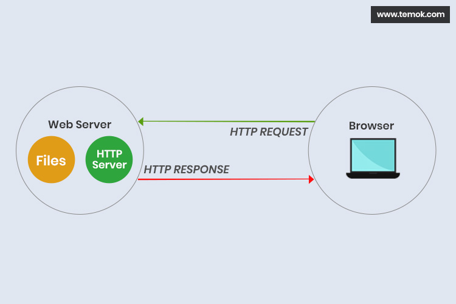
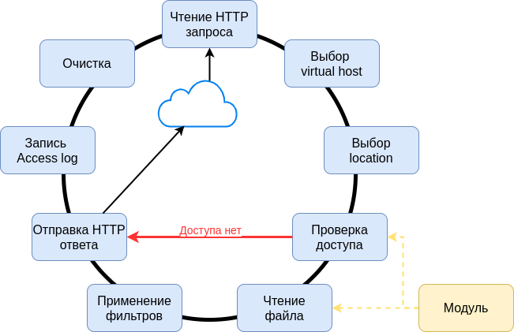

# Веб сервера

## Начало начал

Давайте вернемся в древность к динозаврам и посмотрим как тогда работал интернет.

В то время сайты представляли из себя набор HTML и CSS файлов. Тоесть сайты были статическими. И эти файлы нужно было отдавать пользователям на их запросы используя HTTP протокол. Для этого были созданы веб сервера.



> Веб-сервер — сервер, принимающий HTTP-запросы от клиентов, обычно веб-браузеров, и выдающий им HTTP-ответы, как правило, вместе с HTML-страницей, изображением, файлом, медиа-потоком или другими данными.

## Nginx

Nginx  — веб-сервер и почтовый прокси-сервер, работающий на Unix-подобных операционных системах. Это один из самых быстрых и распространенных веб серверов.

> Игорь Сысоев начал разработку в 2002 году. Осенью 2004 года вышел первый публично доступный релиз. С июля 2011 работа над nginx продолжается в рамках компании Nginx.

### Установка NGINX

Наиболее простой способ установить Nginx из менеджера пакетов.

**Ubuntu:**

```bash
sudo apt update
sudo apt install nginx
```

> [Гайд по установке Nginx на Ubuntu](https://www.digitalocean.com/community/tutorials/how-to-install-nginx-on-ubuntu-20-04-ru)

### Запуск NGINX

Nginx это демон - он не будет связан с терминалом. Команда для запуска `./etc/init.d/nginx start` или просто `nginx`

> Для просмотра списка всех запущенных процессов nginx может быть использована утилита ps, например, следующим образом: `ps -ax --forest | grep nginx`

### [Параметры командной строки nginx](http://nginx.org/ru/docs/switches.html)

- `-?` | `-h` — вывод справки по параметрам командной строки.
- `-c файл` — использование альтернативного конфигурационного файла файл вместо файла по умолчанию.
- `-e файл` — использование альтернативного лог-файла ошибок файл вместо файла по умолчанию (1.19.5). Специальное значение stderr выбирает стандартный файл ошибок.
- `-g директивы` — задание глобальных директив конфигурации, например

    > nginx -g "pid /var/run/nginx.pid; worker_processes `sysctl -n hw.ncpu`;"

- `-p префикс` — задание префикса пути nginx, т.е. каталога, в котором будут находиться файлы сервера (по умолчанию — каталог /usr/local/nginx).
- `-q` — вывод только сообщений об ошибках при тестировании конфигурации.
- `-s сигнал` — отправка сигнала главному процессу. Аргументом сигнал может быть:
  - `stop` — быстрое завершение
  - `quit` — плавное завершение
  - `reload` — перезагрузка конфигурации, старт нового рабочего процесса с новой конфигурацией, плавное завершение старых рабочих процессов.
  - `reopen` — переоткрытие лог-файлов
- `-t` — тестирование конфигурационного файла: nginx проверяет синтаксическую правильность конфигурации, а затем пытается открыть файлы, описанные в конфигурации.
- `-T` — то же, что и -t, а также вывод конфигурационных файлов в стандартный поток вывода (1.9.2).
- `-v` — вывод версии nginx.
- `-V` — вывод версии nginx, версии компилятора и параметров конфигурации сборки.

#### Порядок запуска

- Вычитывается файл конфигурации
- Получаются необходимые порты ( *посколько мы юзаем 80 порт нам немходимо запускать демона от sudo пользователя* )
- Открывает (*создает*) файл логов
- Понижает привилегии (*подменяет имя пользователя*)
- Запускает дочерние процессы/потоки (`wrokers`)
- Все готово можно работать

### Файлы веб сервера

- Конфиг `/etc/nginx/nginx.conf`, конфиг может быть достаточно большим поэтому его могут разбивать на куски и подключать их, например `include /etc/nginx/sites-enabled/*`
- PID-файл - файл где хранится ид процесса родителя `/var/run/nginx.pid`
- Error-лог - файл логов ошибок веб сервера `/var/log/nginx/error.log`
- Access-лог - лог обрабатываемых запросов `/var/log/nginx/access.log`

### Процессы веб сервера

- Master (user: `root`, 1 процесс)
  - Чтение и валидация конфига
  - Открытие сокетов и логов
  - Запуск и управление дочерними процессами (*worker*)
  - Graceful restart, Binary update
- Worker (user: `www-data`, 1+ процессов)
  - Обработка входящих запросов

### Worker

Воркер это дочерний процесс который отвечает за обработку HTTP запросов



- Worker получает сетевое соединение и начинает вычитывать из него данные
- Выбирается virtual `host на основе` заголовка `Host` у запроса
- Выбираеться `location`, который отвечает за обработку групы url. Сервер понимает какой файл ему нужно отдавать склеив `url` и `root` указанный в `location`
- Сервер проверяет доступ
  - Можно ограничить ip на акоторые мы отдаем файл
  - Можно потребовать авторизацию
  - Проверка доступа к файлу на диске
- Чтение файла
- Применение фильтров (сжатие gzip, отправка документа по частям, устанавливаем заголовки ответов)
- Запись логов о том кому и что мы отправили с каким кодом ответа
- Очистка внутрених структур

### Модульная архитектура

- Веб сервер не монолитный, поэтому сервер сделан модульный. У сервера есть ядро отвечающее за работу с протоколом HTTP и выделяются модули которые могут добавлять различный функционал на различных этапах.
- Для добавления модуля Nginx необходимо скомпилировать с этим модулем

### Конфигурация веб сервера

#### Структура конфигурационного файла

nginx состоит из модулей, которые настраиваются директивами, указанными в конфигурационном файле. Директивы делятся на простые и блочные. Простая директива состоит из имени и параметров, разделённых пробелами, и оканчивается точкой с запятой `;`. Блочная директива устроена так же, как и простая директива, но вместо точки с запятой после имени и параметров следует набор дополнительных инструкций, помещённых внутри фигурных скобок `{` и `}`. Если у блочной директивы внутри фигурных скобок можно задавать другие директивы, то она называется контекстом (примеры: `events`, `http`, `server` и `location`).

Директивы, помещённые в конфигурационном файле вне любого контекста, считаются находящимися в контексте main. Директивы `events` и `http` располагаются в контексте `main`, server — в `http`, а `location` — в `server`.

Часть строки после символа `#` считается комментарием.

- `http` - Предоставляет контекст конфигурационного файла, в котором указываются директивы HTTP-сервера.
- `server` - Задаёт конфигурацию для виртуального сервера. Чёткого разделения виртуальных серверов на IP-based (на основании IP-адреса) и name-based (на основании поля “Host” заголовка запроса) нет. Вместо этого директивами `listen` описываются все адреса и порты, на которых нужно принимать соединения для этого сервера, а в директиве `server_name` указываются все имена серверов.
- `location` - Устанавливает конфигурацию в зависимости от URI запроса.
- `events` - Предоставляет контекст конфигурационного файла, в котором указываются директивы, влияющие на обработку соединений.
- `include` -  Включает в конфигурацию другой файл или файлы, подходящие под заданную маску. Включаемые файлы должны содержать синтаксически верные директивы и блоки. Пример использования:
    > include mime.types;
    include vhosts/*.conf;
- `error_log` - Лог ошибок сервера
- `access_log` - Лог запросов
- `root` - Задаёт корневой каталог для запросов
- `alias` - Задаёт замену для указанного location’а

#### Простой конфиг

```nginx
# default user is nobody
worker 1;
events {}

http {
    server {
        location / {
            root /usr/files/www; # файлы лежат в /usr/files/www/
        }

        location /images/ {
            root /usr/files; # файлы лежат в /usr/files/images/
        }
    }
}
```

> `location` - задает префикс который сравнивается с URI запроса и добавляет его к `root`. При соответствии URI нескольким location берется самый длинный префикс

### Приоритеты location в nginx

1. `location = /img/1.jpg` - точное совпадение
2. `location ^~ /pic/` - совпадение по префиксу с повышеным приотритетом
3. `location ~* \.jpg$` - совпадение по регулярному выражению
4. `location /img/` - совпадение по префиксу

## Полезные ссылки

- [Курс "Web-технологии" на Stepik](https://stepik.org/course/154/)
- ["Установка nginx на ubuntu" DigitalOcean](https://www.digitalocean.com/community/tutorials/how-to-install-nginx-on-ubuntu-20-04-ru)
- Документация nginx
  - ["Руководство для начинающих"](http://nginx.org/ru/docs/beginners_guide.html)
  - ["Обработка запросов"](http://nginx.org/ru/docs/http/request_processing.html)
  - ["Логирование"](http://nginx.org/ru/docs/debugging_log.html)
  - ["Как nginx обрабатывает запросы"](http://nginx.org/ru/docs/http/request_processing.html)
  - ["Имена сервера"](http://nginx.org/ru/docs/http/server_names.html)
