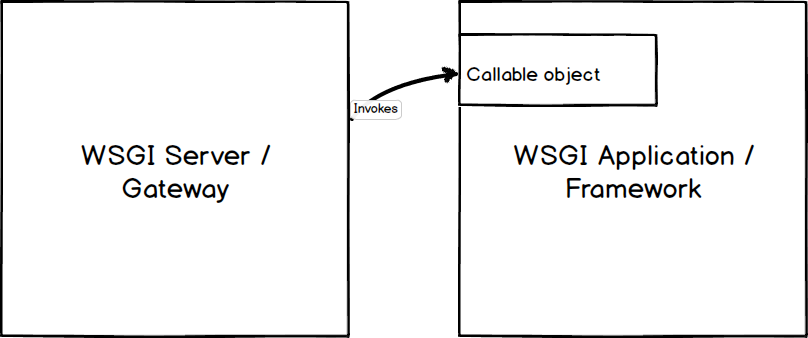
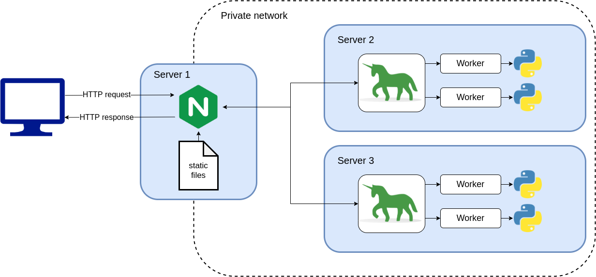
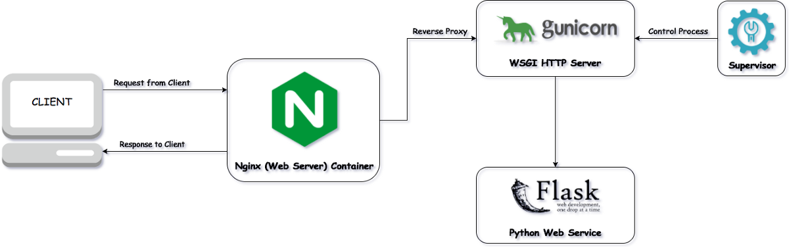
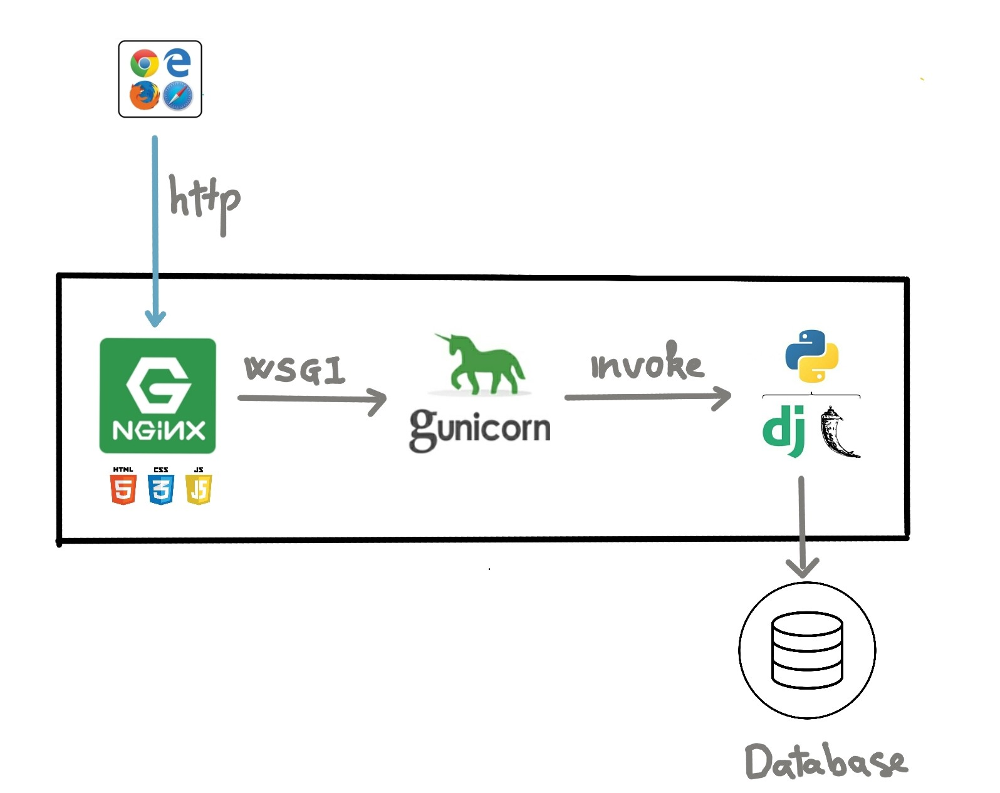
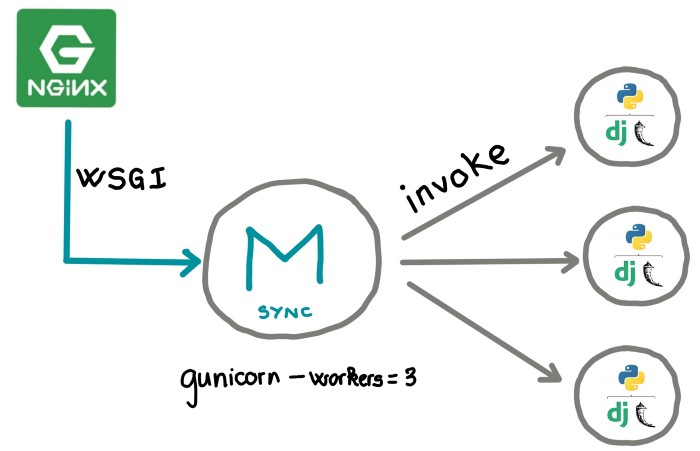
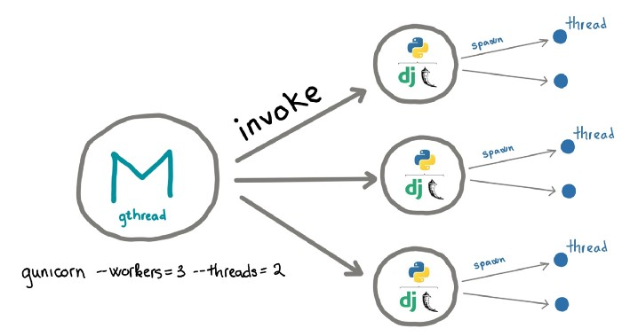
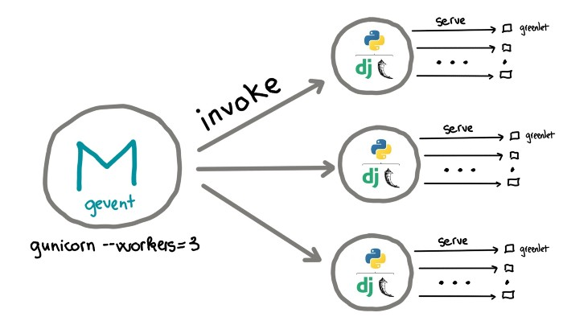

# Backend и Frontend сервера

## Общая архитектура

В наши дни архитектура веб приложения стала намного сложнее. Сайты должны генерировать контент страниц динамически или использовать AJAX подход для загрузки с бекенда веб приложений только данные и рендерить их средствами клиента.

Вот так примерно выглядит инфраструктура веб приложения


Нас здесь интересуют 2 компонента `2` и `3`. `2` это обратный прокси (reverse proxy) а `3` это наше веб приложене. Давайте разбираться как же HTTP запрос доходит до нашего python приложения и возвращается обратно пользователю.

## Backend server

Наше приложение написанное с  использованием например фреймворка Flask, а значит нам нужно его как-то вызывать. Тут нам на помощь приходит `backend server` - это сервер который будет принимать HTTP запрос и каким-то образом вызывать наше приложение передавая туда этот запрос.

### WSGI

Веб сервер должег каким-то образом запускать python код и получать ответ, для этого в `pep3333` был предложен WSGI стандарт для интерфейса связи веб сервера с python приложением.



По стандарту, WSGI-приложение должно удовлетворять следующим требованиям:

- должно быть вызываемым (callable) объектом (обычно это функция или метод)
- принимать два параметра:
  - словарь переменных окружения (environ)
  - обработчик запроса (start_response)
- вызывать обработчик запроса с кодом HTTP-ответа и HTTP-заголовками
- возвращать итерируемый объект с телом ответа

Простейшим примером WSGI-приложения может служить такая функция-генератор:

```python
def application(environ, start_response):
    start_response('200 OK', [('Content-Type', 'text/plain')])
    yield b'Hello, World!\n'
```

Помимо приложений и серверов, стандарт дает определение middleware-компонентов, предоставляющих интерфейсы как приложению, так и серверу. То есть для сервера middleware является приложением, а для приложения — сервером. Это позволяет составлять «цепочки» WSGI-совместимых middleware. Middleware — простая обертка над объектом приложения, реализовать её можно через замыкание.

Middleware могут брать на себя следующие функции (но не ограничиваются этим):

- обработка сессий
- аутентификация/авторизация
- управление URL (маршрутизация запросов)
- балансировка нагрузки
- пост-обработка выходных данных (например, проверка на валидность)
- изменение заголовков

### Gunicorn

Gunicorn «Green Unicorn» - это Python WSGI HTTP-сервер для UNIX. Это pre-fork модель, портированная из проекта Ruby Unicorn. Сервер Gunicorn широко совместим с различными веб-фреймворками, прост в реализации, требует минимальных ресурсов сервера и довольно быстр.



<!--  -->

<!--  -->

**Как установить gunicorn**:

```bash
pip install gunicorn
```

**Как запустить gunicorn**:

```bash
gunicorn [OPTIONS] [WSGI_APP]
```

Где `WSGI_APP` имеет шаблон `$(MODULE_NAME):$(VARIABLE_NAME)`. Имя модуля может быть полным путем, разделенным точками. Имя переменной относится к вызываемому объекту WSGI, который должен находиться в указанном модуле. Например:

```bash
gunicorn src.main:app
```

#### Часто используемые аргументы

- `-c CONFIG`, `--config=CONFIG` - Указывает файл конфигурации в виде `$(PATH)`, `file:$(PATH)`, или `python:$(MODULE_NAME)`. По умолчанию `./gunicorn.conf.py`
- `-b BIND`, `--bind=BIND` - Указывает серверный сокет для привязки. Серверные сокеты могут быть вида `$(HOST)`, `$(HOST):$(PORT)`, `fd://$(FD)` или `unix:$(PATH)`. IP - это действительный `$(HOST)`.
- `-w WORKERS`, `--workers=WORKERS` - Количество рабочих процессов. Это число обычно должно составлять от 2 до 4 рабочих на ядро ​​сервера.
- `-k WORKERCLASS`, `--worker-class=WORKERCLASS` - Тип выполняемого рабочего процесса. Есть такие типы: `sync`, `eventlet`, `gevent`, `tornado`, `gthread`. По умолчанию используется `sync`.
- `-n APP_NAME`, `--name=APP_NAME` - Изменяет имя процесса на `$(APP_NAME)`, необходимо чтоб был установлен `setproctitle`
- `--reload` - Рестартит рабочие процессы при изменении кода.

#### Worker types

##### request per process

В этом параметре максимальное количество одновременных запросов равно количеству рабочих процессов.



##### request per thread

В этом варианте каждый рабочий процесс может порождать несколько потоков. Приложение Python загружается один раз для каждого рабочего, и каждый из потоков, порожденных одним и тем же рабочим, использует одно и то же пространство памяти. Максимальное количество одновременных запросов `number of workers * number of threads`.



##### request per coroutines

Используя этот тип рабочего, рабочий процесс не будет ждать ввода-вывода и продолжит принимать и обрабатывать другие запросы, пока этот ввод-вывод не будет завершен. Теоретически максимальное количество одновременных запросов очень велико.



## Frontend server (Revers proxy)

`Обратный прокси-сервер (Revers proxy)` - это сервер, который находится перед одним или несколькими веб-серверами и перехватывает запросы от клиентов. Обычно он находится за фаерволом в приватной подсети. При использовании обратного прокси-сервера, когда клиенты отправляют запросы на исходный сервер веб-сайта, эти запросы перехватываются на границе сети обратным прокси-сервером. Затем обратный прокси-сервер будет отправлять запросы и получать ответы от исходного сервера.


Для чего нужен `reverse proxy`:

- `Балансировка нагрузки (Load balancing)` - позволяет вертикально масштабировать наш сервер, вместого того чтобы использовать один физический сервер мы можем использовать несколько физических серверов выполняющих одинаковые функции и спомощью `балансировщика нагрузки` распределять запросы между этими серверами.
- `Веб-ускорение (Web acceleration)` - Обратные прокси-серверы могут сжимать входящие и исходящие данные, а также кэшировать часто запрашиваемый контент, что ускоряет поток трафика между клиентами и серверами. Они также могут выполнять дополнительные задачи, такие как шифрование SSL, чтобы снизить нагрузку на ваши веб-серверы, тем самым повышая их производительность.
- `Безопасность и анонимность (Security and anonymity)` - Перехватывая запросы, направляемые к вашим внутренним серверам, обратный прокси-сервер защищает их личность и действует как дополнительная защита от атак безопасности. Это также гарантирует, что к нескольким серверам можно будет получить доступ с одного указателя записей или URL-адреса независимо от структуры вашей локальной сети. Также позволяет использовать защищеный протокол HTTPS который использует SSL шифрование.

> Также фронтенд сервер может раздавать статику (html, css, js и т.д.).

### Nginx как обратный прокси

`proxy_pass` -  Задаёт протокол и адрес проксируемого сервера, а также необязательный URI, на который должен отображаться location. В качестве протокола можно указать “http” или “https”. Адрес может быть указан в виде доменного имени или IP-адреса, и необязательного порта: `proxy_pass http://localhost:8000/uri/;`

или в виде пути UNIX-сокета, который указывается после слова “unix” и заключается в двоеточия: `proxy_pass http://unix:/tmp/backend.socket:/uri/;`

> Если мы не указываем uri в `proxy_pass` то uri будет передан как есть

#### Балансировка нагрузки

`upstream` - Описывает группу серверов. Серверы могут слушать на разных портах. Кроме того, можно одновременно использовать серверы, слушающие на TCP- и UNIX-сокетах.

у директивы `server` есть пару интересных аргументов:

- `weight=число` - задаёт вес сервера, по умолчанию 1.
- `max_conns=число` - ограничивает максимальное число одновременных активных соединений к проксируемому серверу. по умолчанию 0 - значит неограниченное число.
- `max_fails=число` - задаёт число неудачных попыток работы с сервером, которые должны произойти в течение времени, заданного параметром fail_timeout, чтобы сервер считался недоступным на период времени, также заданный параметром `fail_timeout`.
- `fail_timeout=время` задаёт:
  - время, в течение которого должно произойти заданное число неудачных попыток работы с сервером для того, чтобы сервер считался недоступным;
  - и время, в течение которого сервер будет считаться недоступным.
    По умолчанию параметр равен 10 секундам.
- `backup` - помечает сервер как запасной сервер. На него будут передаваться запросы в случае, если не работают основные серверы.
    > Параметр нельзя использовать совместно с методами балансировки нагрузки hash, ip_hash и random.

Когда Nginx проксирует запрос, он автоматически вносит некоторые поправки в заголовки, полученные от клиента.

- Nginx избавляется ото всех пустых заголовков. Нет смысла передавать пустые значения другому серверу; это только усложнит передачу запроса.
- Все заголовки, которые содержат символы подчеркивания, Nginx по умолчанию рассматривает как недопустимые. Он удалит их из запроса. Если вы хотите, чтобы Nginx интерпретировал их как валидные, вы можете установить в директиве underscores_in_headers значение on, в противном случае такие заголовки никогда не попадут на бэкэнд-сервер.
- Заголовок Host переписывается значением, определяемым переменной $proxy_host. Это может быть IP-адрес или имя и номер порта upstream сервера, как указано в директиве proxy_pass.
- Заголовок Connection заменяется значением close. Этот заголовок используется для передачи информации о конкретном соединении, установленном между двумя сторонами. В этом случае Nginx устанавливает это значение, чтобы указать upstream серверу, что это соединение будет закрыто после ответа на исходный запрос. Не следует ожидать, что это upstream соединение будет постоянным.

Пример конфига:

```nginx
upstream backend {
    server 0.0.0.0:8001   weight=5;
    server 0.0.0.0:8002;

    server 0.0.0.0:8003   backup;
}

server {
    location / {
        proxy_pass http://backend;
        proxy_redirect     off;

        proxy_set_header   Host             $host;
        proxy_set_header   X-Real-IP        $remote_addr;
        proxy_set_header   X-Forwarded-For  $proxy_add_x_forwarded_for;
    }
}
```

## Полезные ссылки

- ["Web architecture 101" Medium](https://medium.com/storyblocks-engineering/web-architecture-101-a3224e126947)
- ["Reverse proxy"](https://www.cloudflare.com/learning/cdn/glossary/reverse-proxy/)
- ["Проксирование, балансировка нагрузки"](https://www.8host.com/blog/osnovy-raboty-s-nginx-proksirovanie-balansirovka-nagruzki-buferizaciya-i-keshirovanie/)
- ["Selecting gunicorn worker types for different python web applications"](https://medium.com/@nhudinhtuan/gunicorn-worker-types-practice-advice-for-better-performance-7a299bb8f929)
- ["WSGI interface"](https://www.fullstackpython.com/wsgi-servers.html)
- ["pep3333"](https://www.python.org/dev/peps/pep-3333/)
- ["What is WSGI and Why Do You Need Gunicorn and Nginx in Django"](https://apirobot.me/posts/what-is-wsgi-and-why-do-you-need-gunicorn-and-nginx-in-django)
- ["Selecting gunicorn worker types"](https://medium.com/@nhudinhtuan/gunicorn-worker-types-practice-advice-for-better-performance-7a299bb8f929)
- Nginx documentation
  - ["Модуль ngx_http_upstream_module"](https://nginx.org/ru/docs/http/ngx_http_upstream_module.html#least_conn)
  - ["Проксирование WebSocket"](https://nginx.org/ru/docs/http/websocket.html)
