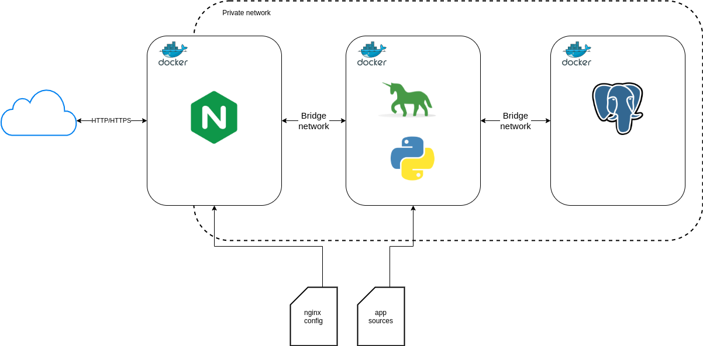
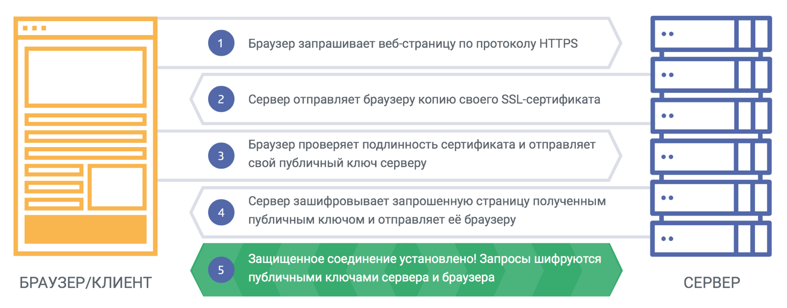

# Docker, SSL and other

## NGINX and Docker

Мы можем запустить контейнер для nginx, контейнер для нашего приложения и контейнер для БД, они будут в изолированой сети, и наружу будет смотреть только nginx на порту `80`.

## HTTPS

**HTTPS** (аббр. от англ. HyperText Transfer Protocol Secure) — расширение протокола HTTP для поддержки шифрования в целях повышения безопасности. Данные в протоколе HTTPS передаются поверх криптографических протоколов TLS или устаревшего в 2015 году SSL. В отличие от HTTP с TCP-портом `80`, для HTTPS по умолчанию используется TCP-порт `443`.

HTTPS не является отдельным протоколом. Это обычный HTTP, работающий через шифрованные транспортные механизмы `SSL` и `TLS`. Он обеспечивает защиту от атак, основанных на прослушивании сетевого соединения — от снифферских атак и атак типа man-in-the-middle, при условии, что будут использоваться шифрующие средства и сертификат сервера проверен и ему доверяют.

## Полезные ссылки

["Знакомство с SSL/TLS"](https://habr.com/ru/company/1cloud/blog/326292/)
["Как защитить сайт с помощью HTTPS"](https://developers.google.com/search/docs/advanced/security/https?hl=ru#verify-that-your-https-pages-can-be-crawled-and-indexed-by-google)
["Self signed certificate"](https://imagineer.in/blog/https-on-localhost-with-nginx/)
["Nginx and Certbot" Medium](https://gist.github.com/dancheskus/8d26823d0f5633e9dde63d150afb40b2)
["Nginx and Certbot" DigitalOcean](https://www.digitalocean.com/community/tutorials/how-to-secure-a-containerized-node-js-application-with-nginx-let-s-encrypt-and-docker-compose-ru)
