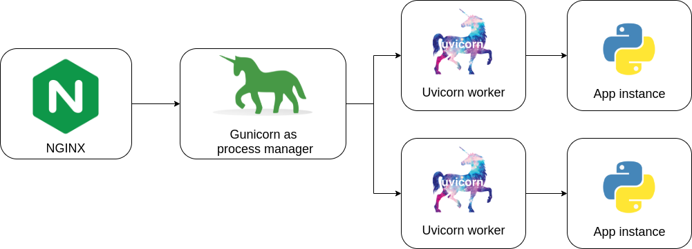

# Новомодные эти ваши асинхронщины

## ASGI

`ASGI` является духовным преемником `WSGI`, давнего стандарта Python для совместимости между веб-серверами, фреймворками и приложениями.


`WSGI` удалось предоставить гораздо больше свободы и инноваций в веб-пространстве Python, и цель `ASGI` - продолжить это в области асинхронного Python.

Приложения `WSGI` - это один синхронный вызываемый объект, который принимает запрос и возвращает ответ; это не позволяет устанавливать долговременные соединения, как в случае соединений long-polling HTTP или WebSocket.

Даже если мы сделаем этот вызываемый асинхронным, у него все равно будет только один путь для предоставления запроса, поэтому протоколы, которые имеют несколько входящих событий (например, получение кадров WebSocket), не могут его вызвать.

`ASGI` структурирован как один асинхронный вызываемый обьект (callable). Он принимает `scope`, которая представляет собой `dict`, содержащий сведения о конкретном соединении, `send` - асинхронный вызываемый объект, который позволяет приложению отправлять сообщения о событиях клиенту и, `recieve` асинхронный вызываемый объект, который позволяет приложению получать сообщения о событиях от клиента.

`ASGI` состоит из двух различных компонентов:

- Сервера протокола (protocol server) — слушает сокеты и преобразует их в соединения и сообщения о событиях внутри каждого соединения.
- Приложения (application), которое живет внутри сервера протокола, его экземпляр создается один раз для каждого соединения и обрабатывает сообщения о событиях по мере их возникновения.


Таким образом, согласно спецификации, то, что действительно указывает ASGI — это формат сообщения и то, как эти сообщения должны передаваться между приложением и сервером протокола, который его запускает.

## Uvicorn

`Uvicorn` - это молниеносная `ASGI` сервер, использующий uvloop и httptools.


### Установка

```bash
# Установит питон с минимальным числом (чисто питоновских) зависимостей.
pip install Uvicorn

# Это установит uvicorn с зависимостями «на основе Cython» (где возможно)
# и другими «необязательными дополнениями».
pip install uvicorn[standard]
```

### Запуск

`uvicorn [OPTIONS] [APP]`
например:
`uvicorn example:app`

`Uvicorn` можно запустить из прямо из приложения:

```python
import uvicorn

async def app(scope, receive, send):
    ...

if __name__ == "__main__":
    uvicorn.run("example:app", host="127.0.0.1", port=5000, log_level="info")
```

### Запуск с Gunicorn

`Uvicorn` предоставляет рабочий класс для `Gunicorn`, позволяющий запускать приложения ASGI со всеми преимуществами производительности `Uvicorn`, а также предоставляет вам полнофункциональное управление процессами `Gunicorn`.

Это позволяет увеличивать или уменьшать количество рабочих процессов на лету, корректно перезапускать рабочие процессы или выполнять обновления сервера без простоев.

Для `production` развертываний в документации рекомендуют использовать Gunicorn с рабочим классом uvicorn.

```bash
gunicorn example:app -w 4 -k uvicorn.workers.UvicornWorker
```



## Traefik

`Traefik` — это обратный прокси-сервер с открытым исходным кодом, обеспечивающий простую работу с микросервисами и/или просто контейнерами с вашими приложениями.

Одним из основных достоинств Traefik является возможность изменения его конфигурации без приостановки работы (“на лету”) при применении любого из поддерживаемых бэкэндов, называемых провайдерами.

## Полезные ссылки

- ["ASGI" Хабр](https://habr.com/ru/post/482936/)
- ["ASGI specification"](https://asgi.readthedocs.io/en/latest/index.html)
- ["Awesome ASGI"](https://github.com/florimondmanca/awesome-asgi)
- ["uvicorn doc"](https://www.uvicorn.org/)

- ["Traefik" Хабр](https://habr.com/ru/post/508636/)
